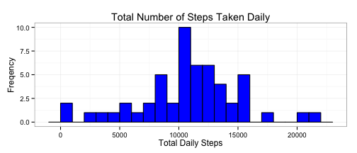
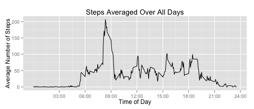
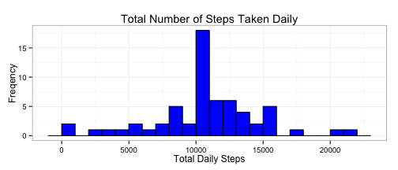
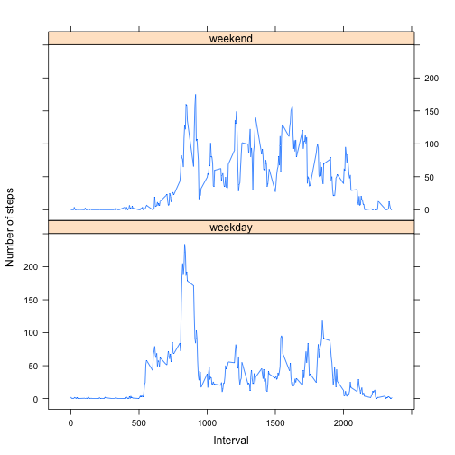

## Loading and preprocessing the data


```r
# load data
data <- read.csv("activity.csv")

# transform date and interval to datetime
data$time <- sprintf("%04i", data$interval)
data$datetime <- as.POSIXlt(paste(data$date, data$time), format="%Y-%m-%d %H%M")
data$date <- as.Date(data$date, format="%Y-%m-%d")

# define function to convert interval to human readable time
timefromintv <- function(intv){
    sub("\\1([0-9][0-9])\\2([0-9][0-9])", "\\1:\\2", sprintf("%04i", intv))
    }
```


## What is mean total number of steps taken per day?

The following code creates a histogram of the total number of steps taken each
day.


```r
library(plyr)
library(ggplot2)

dailySteps <- ddply(data, .(date), summarize, totalsteps=sum(steps))
g <- ggplot(dailySteps, aes(totalsteps))
g <- g + geom_histogram(binwidth=1000, fill="blue", colour="black")
g <- g + labs(title="Total Number of Steps Taken Daily")
g <- g + labs(x="Total Daily Steps", y="Freqency")
g <- g + theme_bw()
print(g)
```

 

The **mean** number of steps each day is 
10766
and the **median** is 
10765.


## What is the average daily activity pattern?

To find the average daily pattern of steps taken, we average the number of steps
taken for each 5-minute interval throughout the day. The daily pattern is shown 
below in a line graph.

```r
intervalSteps <- ddply(data, .(interval), summarize, 
                       avgsteps=mean(steps, na.rm=TRUE))
ticks <- seq(300, 2400, 300)
tlabs <- timefromintv(ticks)
g <- ggplot(intervalSteps, aes(interval, avgsteps))
g <- g + geom_line()
g <- g + labs(title="Steps Averaged Over All Days")
g <- g + labs(x="Time of Day", y="Average Number of Steps")
g <- g + scale_x_continuous(breaks=ticks, labels=tlabs)
print(g)
```

 

The maximum number of steps on average over all the days occur during the five minute interval beginning at 
08:35.


### Inputting missing values

Note that there are a number of days/intervals where there are missing values
(coded as `NA`). The presence of missing days may introduce bias into some
calculations or summaries of the data.

Of the 17568 total intervals in the dataset, 2304 values are missing (13%), coded as `NA`. The presence of this missing data may
introduce bias into calculations and summaries of the data. To explore the 
possibility of this bias, we will add estimated values in place of the missing
data and explore how this addition changes the distribution of the total number
of steps taken each day, as calculated in the section above 'Mean total number
of steps'.


2. Use the mean number of steps for each interval to estimate the missing 
values. Estimated values are rounded to the nearest integer.

3. Create a new dataset that is equal to the original dataset but with the missing data filled in.


```r
dataest <- merge(data, intervalSteps, by="interval")
dataest <- dataest[order(dataest$datetime),]
dataest$stepsest <- dataest$steps
dataest$missing <- is.na(dataest$steps)
dataest$stepsest[dataest$missing] <- round(dataest$avgsteps[dataest$missing])
dataest$stepsest <- as.integer(dataest$stepsest)
```


4. The plot below shows a histogram of the number of steps taken each day, as
calculated using the dataset with the missing values estimated by the average
number of steps taken during each interval over all the days, as described 
above.


```r
dailyStepsEst <- ddply(dataest, .(date), summarize, totalsteps=sum(stepsest))
g <- ggplot(dailyStepsEst, aes(totalsteps))
g <- g + geom_histogram(binwidth=1000, fill="blue", colour="black")
g <- g + labs(title="Total Number of Steps Taken Daily")
g <- g + labs(x="Total Daily Steps", y="Freqency")
g <- g + theme_bw()
print(g)
```

 


The **mean** number of steps each day using this estimated data set is 
10766 and the **median** is 10762. 

Due to rounding the avgerage number of steps for each interval when estimating 
the missing data, the total number of steps in an estimated day is 
10762, though the total number of steps without rounding is the mean 
number of total  steps as caluclated in the first section of this document, 
'Mean total number of steps', 10766. The original data set is missing 
step counts for 8 of 61 days. Adding estimated data to these days with total step count 10762 for 8 days increases
the frequency of that value, raising the highest peak in the histogram from 
10 to 18. This method of estimating the missing data had a small effect on the 
mean and is not apparent in the rounded value, but it did lower the median by adding several data point below the original median to the data set.


### Are there differences in activity patterns between weekdays and weekends?


```r
# define a function to return weekday or weekend for a given datetime
weekendfactor <- function(dt){
    wday <- weekdays(dt)
    if(wday %in% c("Monday", "Tuesday", "Wednesday", "Thursday", "Friday")){
        return("weekday")
    }
    else if(wday %in% c("Saturday", "Sunday")){
        return("weekend")
    }
}

# create a weekday/weekend factor variable for each observation 
dataest$weekdayf <- factor(sapply(dataest$date, weekendfactor))


# create a panel plot of the number of steps averaged over all weekday and
# all weekend days
library(lattice)
weekdayIntvSteps <- ddply(dataest, .(interval, weekdayf), summarize, 
                       avgsteps=mean(steps, na.rm=TRUE))
xyplot(avgsteps ~ interval | weekdayf, data=weekdayIntvSteps, type='l', 
       layout=c(1,2), xlab="Interval", ylab="Number of steps")
```

 


